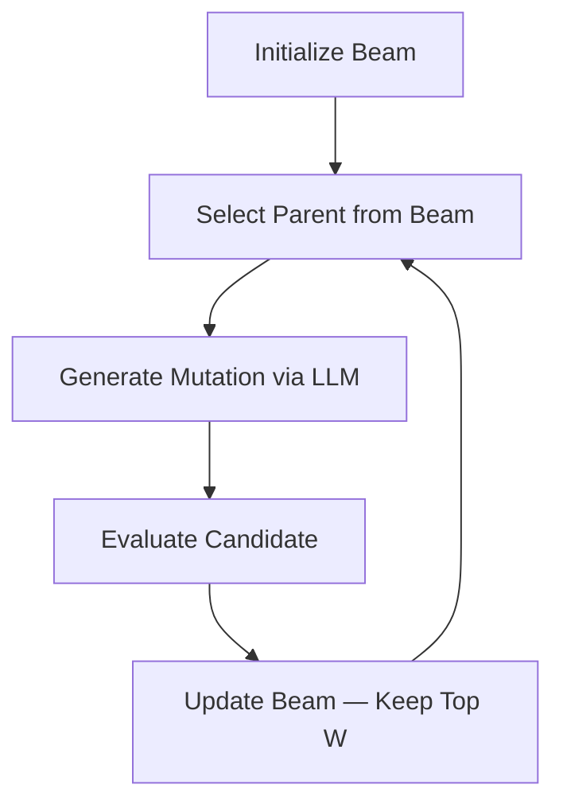

## Overview

Beam Search maintains a fixed-width beam of the most promising candidate solutions. At each iteration, it selects a parent from the beam, generates a mutation, and updates the beam — keeping only the top solutions by score. This provides controlled breadth-first exploration without the full cost of exploring all branches.

### Features

- **Parallel paths** — maintains multiple promising solutions simultaneously
- **Controlled breadth** — beam width limits memory and computation
- **Flexible selection** — four strategies for choosing which beam member to expand next
- **Depth tracking** — tracks the evolutionary depth of each solution for analysis

---

## How It Works

### Beam Maintenance Cycle



1. **Initialization** — the beam starts with the initial program (or a from-scratch generation)
2. **Selection** — choose which beam member to expand next (see selection strategies below)
3. **Generation** — the LLM generates a mutated version of the selected parent
4. **Evaluation** — the evaluator scores the candidate
5. **Beam update** — if the beam is full, the lowest-scoring member is evicted if the new candidate is better

### Selection Strategies

| Strategy | Description |
|:---------|:------------|
| `best` | Always select the highest-scoring beam member. Pure exploitation |
| `stochastic` | Weighted random selection — higher scores get higher probability, controlled by `beam_temperature` |
| `round_robin` | Cycle through beam members in order. Guarantees each member gets expanded |
| `diversity_weighted` | Balance score and code diversity. Controlled by `beam_diversity_weight` |

### Beam Pruning

When the beam is full and a new program arrives:

- **Pure fitness** — keep the top `beam_width` programs by `combined_score`
- **Diversity-aware** — when `beam_diversity_weight > 0`, pruning also considers how different each beam member is from the others, preserving diverse approaches

---

## Configuration

### CLI

```bash
uv run skydiscover-run initial_program.py evaluator.py \
  --search beam_search \
  --iterations 100
```

### Full Configuration

```yaml
max_iterations: 100
diff_based_generation: true

llm:
  models:
    - name: "gpt-5"
      weight: 1.0

search:
  type: "beam_search"
  database:
    beam_width: 5
    beam_selection_strategy: "diversity_weighted"
    beam_diversity_weight: 0.3
    beam_temperature: 1.0
    beam_depth_penalty: 0.0

prompt:
  system_message: |
    You are an expert algorithm designer.
```

### Config Options

| Option | Default | Description |
|:-------|:--------|:------------|
| `beam_width` | `5` | Maximum number of programs in the beam |
| `beam_selection_strategy` | `"diversity_weighted"` | How to select the next parent: `best`, `stochastic`, `round_robin`, `diversity_weighted` |
| `beam_diversity_weight` | `0.3` | Weight for diversity in selection/pruning (0 = pure fitness, 1 = pure diversity) |
| `beam_temperature` | `1.0` | Temperature for stochastic selection. Lower = more greedy, higher = more random |
| `beam_depth_penalty` | `0.0` | Penalty per depth level. Discourages very deep evolutionary chains |

---

## When to Use Beam Search

<CardGroup cols={2}>
  <Card title="Best For" icon="check">
    - Discrete optimization with branching decision points
    - Medium-length runs (50–200 iterations)
    - Problems where maintaining a few parallel approaches is valuable
    - Controlled exploration with bounded resources
  </Card>
  <Card title="Avoid When" icon="xmark">
    - Maximum diversity is needed — island-based methods explore more broadly
    - Very short runs (< 20 iterations) — beam doesn't fill up
    - Problems requiring population-level dynamics (crossover, migration)
  </Card>
</CardGroup>

---

## Example

```bash
uv run skydiscover-run benchmarks/math/circle_packing/initial_program.py \
  benchmarks/math/circle_packing/evaluator.py \
  --search beam_search \
  --iterations 100
```

```python
from skydiscover import run_discovery

result = run_discovery(
    initial_program="initial_program.py",
    evaluator="evaluator.py",
    search="beam_search",
    model="gpt-5",
    iterations=100,
)
```

---

## Monitoring

### Beam Statistics

Track the beam state during the run:

| Metric | Description |
|:-------|:------------|
| Beam size | Current number of programs in the beam |
| Best score | Highest `combined_score` in the beam |
| Score spread | Difference between best and worst beam member |
| Mean depth | Average evolutionary depth of beam members |
| Unexpanded | Number of beam members not yet used as parents |

### Beam Contents

Each beam member stores:
- Program ID and source code
- `combined_score` and all metrics
- Evolutionary depth (how many generations from the initial program)
- Parent ID (which beam member it was derived from)

---

## Advanced

### Dynamic Beam Width

Start with a wider beam for exploration, then narrow it for exploitation:

```yaml
search:
  database:
    beam_width: 10   # start wide
```

After initial exploration, reduce the beam width in a follow-up run to focus on the top candidates.

### Restart Strategy

If the beam converges to similar solutions, restart with a fresh from-scratch generation:

```bash
uv run skydiscover-run evaluator.py \
  --search beam_search \
  --iterations 50
```

Omitting the initial program forces the LLM to generate diverse starting points.

---

## Comparison

| Feature | Beam Search | AdaEvolve | Top-K | Best-of-N |
|:--------|:------------|:----------|:------|:----------|
| Parallel candidates | Yes — beam width | Yes — islands | No — single best | No — single parent |
| Selection strategy | 4 strategies | UCB-based | Greedy | Fixed parent |
| Diversity control | `diversity_weight` | Island isolation | None | None |
| Depth tracking | Yes | No | No | No |
| Overhead | Low | Medium | Minimal | Minimal |

---

## Tips

- **Start with `diversity_weighted`** — it provides a good balance between score optimization and maintaining diverse approaches
- **Tune beam width to budget** — `beam_width` of 3–5 for short runs, 5–10 for longer runs
- **Monitor unexpanded programs** — if beam members are never selected as parents, the beam width may be too large
- **Lower temperature for convergence** — set `beam_temperature: 0.5` to focus on top candidates as the run progresses
