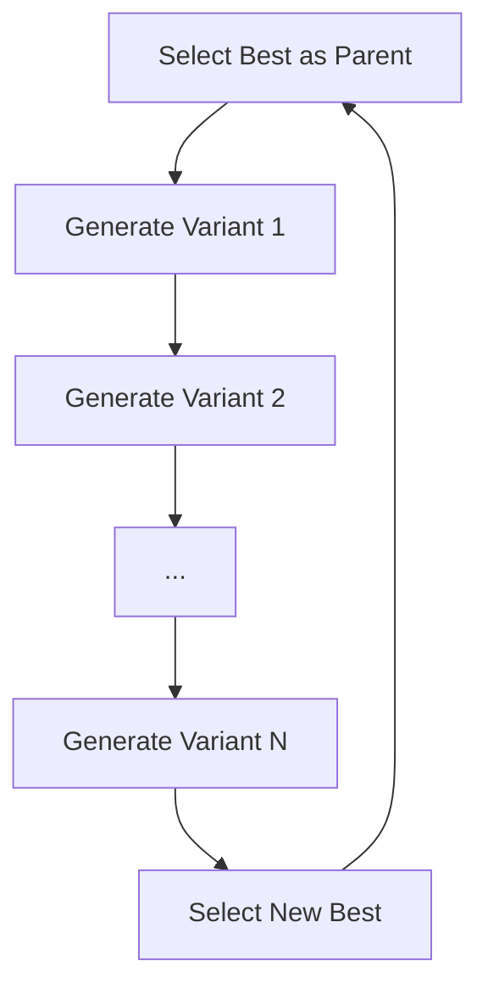

## Overview

Best-of-N is a focused exploration strategy that reuses the same parent program for N consecutive iterations, generating N variants before moving on. After N attempts, the best overall program becomes the new parent. This gives the LLM multiple chances to improve a given solution before the search moves forward.

### Features

- **Focused exploration** — the same parent is mutated N times, thoroughly exploring its neighborhood
- **Automatic reset** — after N iterations, the best program is selected and the cycle restarts
- **Simple logic** — minimal overhead, easy to understand and tune
- **Efficient sampling** — context programs are refreshed each iteration while the parent stays fixed

---

## How It Works

### Iteration Cycle



1. **Parent selection** — the highest-scoring program becomes the parent
2. **N variants** — the parent is used for N consecutive iterations, each generating a new mutation
3. **Reset at N+1** — after N iterations with the same parent, the overall best program is selected as the new parent
4. **Context refresh** — context programs (top-K excluding the parent) are sampled fresh each iteration

---

## Configuration

### CLI

```bash
uv run skydiscover-run initial_program.py evaluator.py \
  --search best_of_n \
  --iterations 100
```

### Python API

```python
from skydiscover import run_discovery

result = run_discovery(
    initial_program="initial_program.py",
    evaluator="evaluator.py",
    search="best_of_n",
    model="gpt-5",
    iterations=100,
)
```

### Full Configuration

```yaml
max_iterations: 100
diff_based_generation: true

llm:
  models:
    - name: "gpt-5"
      weight: 1.0

search:
  type: "best_of_n"
  database:
    best_of_n: 5

prompt:
  system_message: |
    You are an expert algorithm designer.
```

### Config Options

| Option | Default | Description |
|:-------|:--------|:------------|
| `best_of_n` | `5` | Number of variants to generate per parent before resetting |

**Recommended values:**

| Scenario | N | Reasoning |
|:---------|:--|:----------|
| Limited budget (< 50 iterations) | 3–5 | Enough variants without exhausting budget |
| Standard runs (50–200 iterations) | 5–10 | Good balance of depth and breadth |
| High-variance LLMs or creative tasks | 10–20 | More attempts compensate for output variability |

---

## When to Use Best-of-N

<CardGroup cols={2}>
  <Card title="Best For" icon="check">
    - Limited API budget — maximizes value from each parent
    - Thorough local exploration around promising solutions
    - Stochastic or creative tasks where LLM output varies significantly
    - Simple problems where focused refinement works
  </Card>
  <Card title="Avoid When" icon="xmark">
    - Very short runs (< 10 iterations) — too few resets to make progress
    - Deterministic evaluators where the LLM produces similar outputs — N variants won't differ
    - Need for diverse, parallel exploration — use Beam Search or AdaEvolve instead
  </Card>
</CardGroup>

---

## Example: Prompt Optimization

Best-of-N works well for prompt optimization where LLM outputs are highly variable:

```bash
uv run skydiscover-run benchmarks/prompt_optimization/initial_prompt.txt \
  benchmarks/prompt_optimization/evaluator.py \
  --search best_of_n \
  --iterations 50
```

```yaml
language: text
diff_based_generation: false

search:
  type: "best_of_n"
  database:
    best_of_n: 10

prompt:
  system_message: |
    You are an expert prompt engineer. Improve the given prompt
    to maximize accuracy on the evaluation task.
```

---

## Choosing N

### By LLM Variance

| LLM Variance | Recommended N | Example |
|:-------------|:--------------|:--------|
| **High** (creative tasks, high temperature) | 10–20 | Prompt optimization, image generation |
| **Medium** (standard code generation) | 5–10 | Algorithm optimization, math problems |
| **Low** (deterministic, low temperature) | 3–5 | Simple refactoring, parameter tuning |

### By Budget

With a total budget of `T` iterations, the number of parent switches is roughly `T / N`. Balance depth (high N) against breadth (low N):

- `N = 3, T = 90` → 30 parent switches (more breadth)
- `N = 10, T = 90` → 9 parent switches (more depth)

---

## Monitoring

### Parent Switches

Track when the parent changes to understand the search trajectory:

| Metric | Description |
|:-------|:------------|
| Parent ID | Which program is currently being used as parent |
| Variants generated | How many of the N variants have been generated |
| Best variant score | Highest score among the N variants |
| Improvement over parent | Whether any variant beat the parent |

### Variant Analysis

After each N-cycle, compare the N variants to understand LLM behavior:

- **Score variance** — high variance suggests the LLM is exploring meaningfully
- **Score improvement** — at least one variant should improve over the parent in most cycles
- **Duplicate solutions** — if variants are too similar, increase LLM temperature

---

## Comparison

| Feature | Best-of-N | Top-K | Beam Search | AdaEvolve |
|:--------|:----------|:------|:------------|:----------|
| Parent reuse | N iterations | 1 iteration | 1 iteration | 1 iteration |
| Parallel candidates | No | No | Yes (beam) | Yes (islands) |
| Complexity | Minimal | Minimal | Low | Medium |
| Local exploration | Strong | Weak | Moderate | Moderate |
| Global exploration | Weak | Weak | Moderate | Strong |

---

## Advanced

### Adaptive N

Manually increase N when the search is making progress and decrease when it stagnates. This can be configured by adjusting `best_of_n` across runs.

### Diversity Sampling

Context programs are sampled from the top-K programs (excluding the current parent). This gives the LLM awareness of alternative approaches even while focusing on one parent.

---

## Tips

- **Higher temperature helps** — set a higher LLM temperature (0.8–1.0) to increase variant diversity across the N attempts
- **Monitor score variance** — if all N variants have similar scores, the LLM isn't exploring enough
- **Balance N and total budget** — N that is too large wastes budget on a single parent; N that is too small doesn't explore deeply enough
- **Combine with restart** — run multiple Best-of-N sessions with different initial programs to combine local depth with global diversity
