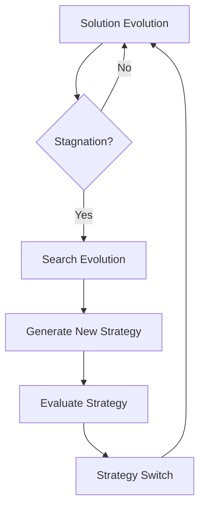

## Overview

EvoX is a meta-evolutionary algorithm that evolves the optimization strategy itself alongside the solutions. Rather than using a fixed search algorithm, EvoX co-evolves a search database implementation and a population of solution programs simultaneously — the search strategy adapts to the problem as the run progresses.

<Note>
  **Paper:** [EvoX: Self-Evolving Search Paradigm for AI-Driven Discovery](https://arxiv.org/abs/2602.23413)
</Note>

### Key Concept: Co-Evolution

Traditional evolutionary search uses a fixed algorithm to evolve solutions. EvoX adds a second layer:

1. **Solution programs** — the actual solutions being optimized (same as any other algorithm)
2. **Search algorithms** — the sampling and selection strategy itself, represented as code that the LLM evolves

Both evolve simultaneously. When the solution search stagnates, EvoX evolves the search algorithm to try a different strategy — then resumes solution evolution with the new strategy.

### Features

- **Self-adaptation** — the search algorithm evolves to fit the problem landscape
- **Meta-learning** — learns which strategies work by scoring search algorithms on their effectiveness
- **Variation operators** — auto-generated diverge (exploration) and refine (exploitation) operators
- **Stagnation-driven** — switches between solution and strategy evolution based on improvement rates

---

## How It Works

### Co-Evolution Loop



1. **Solution evolution** — run iterations using the current search algorithm
2. **Stagnation detection** — if no improvement for a threshold number of iterations, trigger search evolution
3. **Search evolution** — use the LLM to evolve the search algorithm code itself
4. **Strategy switch** — replace the active search algorithm with the evolved version
5. **Continue** — resume solution evolution with the new strategy

### Search Algorithm Scoring

Evolved search algorithms are evaluated on how well they drive solution improvement:

| Metric | Description |
|:-------|:------------|
| `combined_score` | Best solution score achieved by this strategy |
| Absolute improvement | Score gain during this strategy's tenure |
| Relative improvement | Percentage improvement over starting score |
| Iterations to improvement | How quickly the strategy found improvements |
| Improvement rate | Improvements per iteration |

### Variation Operators

EvoX uses two types of operators to evolve search strategies:

- **Diverge** — exploration-focused mutations that make large structural changes to the search algorithm
- **Refine** — exploitation-focused mutations that tune parameters and make incremental improvements
- **Auto-generated** — when `auto_generate_variation_operators` is enabled, the LLM generates custom variation operators tailored to the problem

---

## Usage

### CLI

```bash
uv run skydiscover-run initial_program.py evaluator.py \
  --search evox \
  --iterations 200
```

### Full Configuration

```yaml
max_iterations: 200
diff_based_generation: true

llm:
  models:
    - name: "gpt-5"
      weight: 1.0

search:
  type: "evox"
  database:
    database_file_path: null     # custom initial search algorithm (optional)
    evaluation_file: null        # custom search algorithm evaluator (optional)
    config_path: null            # custom search config (optional)
    auto_generate_variation_operators: true

prompt:
  system_message: |
    You are an expert algorithm designer.
```

### Config Options

| Option | Default | Description |
|:-------|:--------|:------------|
| `database_file_path` | `null` | Path to an initial search algorithm file. When null, uses the built-in default |
| `evaluation_file` | `null` | Custom evaluator for scoring search algorithms |
| `config_path` | `null` | Config for the inner search evolution loop |
| `auto_generate_variation_operators` | `true` | Let the LLM generate custom variation operators |

---

## Initial Search Algorithm Template

When you provide a custom initial search algorithm via `database_file_path`, it must implement a `CustomSearchDatabase` class with `sample` and `add` methods:

```python
from skydiscover.search.base_database import ProgramDatabase, Program
from typing import Any, Dict, List, Optional, Tuple


class CustomSearchDatabase(ProgramDatabase):
    def __init__(self, name, config, **kwargs):
        super().__init__(name, config, **kwargs)
        self.programs = {}

    def add(self, program: Program, iteration=None, **kwargs) -> str:
        self.programs[program.id] = program
        self._update_best_program(program)
        return program.id

    def sample(
        self, num_context_programs=4, **kwargs
    ) -> Tuple[Program, List[Program]]:
        sorted_programs = sorted(
            self.programs.values(),
            key=lambda p: p.metrics.get("combined_score", 0.0),
            reverse=True,
        )
        parent = sorted_programs[0]
        context = sorted_programs[1 : num_context_programs + 1]
        return parent, context
```

EvoX will evolve this code — modifying the sampling strategy, adding new selection logic, introducing population management, and more.

### Search Algorithm Evaluator

The search algorithm evaluator scores how effective a strategy is. It runs the strategy for a fixed number of iterations and measures improvement. The default evaluator is built in, but you can provide a custom one via `evaluation_file`.

---

## When to Use EvoX

<CardGroup cols={2}>
  <Card title="Best For" icon="check">
    - Research and meta-learning experiments
    - Complex optimization landscapes where no single strategy dominates
    - Long runs (200+ iterations) with budget for strategy evolution
    - Problems where the optimal search strategy is unknown
  </Card>
  <Card title="Avoid When" icon="xmark">
    - Short runs (< 50 iterations) — not enough budget for co-evolution
    - Limited API budget — strategy evolution adds LLM calls
    - Well-understood problems where AdaEvolve or Top-K works
  </Card>
</CardGroup>

---

## Advanced Features

### Fallback Mechanism

If an evolved search algorithm fails (crashes or produces worse results), EvoX falls back to the previous working strategy. This ensures the search never degrades due to a bad strategy mutation.

### Migration Between Algorithms

When a new search algorithm is adopted, EvoX migrates the current solution population to the new strategy's database. This preserves progress and avoids starting from scratch.

### Comprehensive Logging

EvoX logs detailed co-evolution data including:

- Strategy evolution triggers and outcomes
- Search algorithm scores and rankings
- Variation operator types used
- Strategy switch events
- Solution improvement trajectories under each strategy

---

## Related Algorithms

- [AdaEvolve](/algorithms/adaevolve) — adaptive search with fixed strategy structure
- [OpenEvolve Native](/algorithms/openevolve-native) — MAP-Elites quality-diversity search
- [Top-K](/algorithms/topk) — simple greedy baseline
