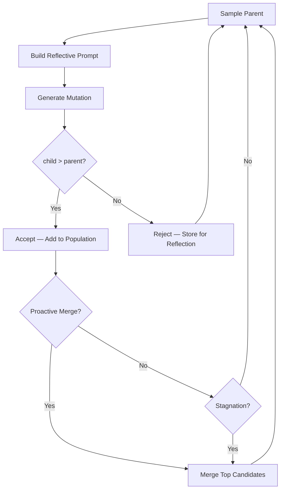

## Overview

GEPA Native is SkyDiscover's built-in reimplementation of the GEPA algorithm, featuring three core innovations that work together to maintain a high-quality population while avoiding solution pollution:

1. **Reflective prompting** — includes rejection history with scores and diagnostics in the LLM prompt
2. **Acceptance gating** — only accepts children that strictly improve upon their parent
3. **LLM-mediated merge** — combines complementary solutions from the Pareto frontier into stronger hybrids

---

## Key Concepts

### 1. Reflective Prompting

Unlike standard evolutionary prompts that only show the current best solution, GEPA Native includes a history of recently rejected solutions in the prompt. This gives the LLM negative examples — showing what was tried and why it failed:

```text
## Recent Rejected Attempts (learn from these failures)

### Attempt 1 (score: 0.42, rejected — parent score was 0.58)
```python
def solve():
    # Used brute force — too slow
    ...
```

### Attempt 2 (score: 0.51, rejected — parent score was 0.58)
```python
def solve():
    # Better but off-by-one in boundary check
    ...
```

Avoid repeating these mistakes. Build on what worked.
```

This reflective feedback helps the LLM avoid repeating failed approaches and learn from past mistakes.

### 2. Acceptance Gating

A child solution is only accepted into the population if its score strictly exceeds the parent's score:

```
child_score > parent_score → ACCEPT (add to population)
child_score ≤ parent_score → REJECT (store in rejection history)
```

Rejected solutions are not discarded — they are stored and used as negative examples in future prompts (reflective prompting). This strict gating prevents solution pollution where mediocre solutions dilute the population.

### 3. LLM-Mediated Merge

GEPA Native periodically merges two complementary solutions into a hybrid:

1. **Select candidates** — pick two programs from the Pareto frontier that excel on different metrics
2. **Build merge prompt** — present both solutions with their strengths to the LLM
3. **Generate merged solution** — the LLM combines the best aspects of both
4. **Accept if improved** — the merged solution goes through the same acceptance gate

---

## Configuration

### CLI

```bash
uv run skydiscover-run initial_program.py evaluator.py \
  --search gepa_native \
  --iterations 200
```

### Full Configuration

```yaml
max_iterations: 200
diff_based_generation: true

llm:
  models:
    - name: "gpt-5"
      weight: 1.0

search:
  type: "gepa_native"
  database:
    population_size: 40
    candidate_selection_strategy: "epsilon_greedy"
    epsilon: 0.1
    max_rejection_history: 20
    acceptance_gating: true
    use_merge: true
    merge_after_stagnation: 15
    max_merge_attempts: 10
    max_recent_failures: 5

prompt:
  system_message: |
    You are an expert algorithm designer.
```

### Config Options

| Option | Default | Description |
|:-------|:--------|:------------|
| `population_size` | `40` | Maximum programs in the elite pool |
| `candidate_selection_strategy` | `"epsilon_greedy"` | Parent selection strategy |
| `epsilon` | `0.1` | Probability of random parent selection (exploration) |
| `max_rejection_history` | `20` | Maximum rejected programs to include in prompts |
| `acceptance_gating` | `true` | Require child > parent score for acceptance |
| `use_merge` | `true` | Enable LLM-mediated merge operations |
| `merge_after_stagnation` | `15` | Iterations without improvement before triggering reactive merge |
| `max_merge_attempts` | `10` | Maximum merge attempts per stagnation event |
| `max_recent_failures` | `5` | Maximum recent failures tracked for reflective prompting |

---

## How It Works

### Evolution Loop



1. **Sample parent** — epsilon-greedy selection from the elite pool
2. **Build reflective prompt** — include parent, context, and rejection history
3. **Generate mutation** — LLM produces a candidate solution
4. **Acceptance gate** — accept only if `child_score > parent_score`
5. **Proactive merge** — after each acceptance, attempt a merge of top candidates
6. **Reactive merge** — on stagnation, force merge attempts to escape local optima
7. **Track improvement** — update stagnation counter

### Merge Candidate Selection

Merge candidates are selected from the Pareto frontier to maximize complementarity:

- The database selects two programs that excel on different metrics
- Programs with similar strengths are avoided (deduplication)
- The merge prompt presents both solutions with their metric profiles

---

## When to Use GEPA Native

<CardGroup cols={2}>
  <Card title="Best For" icon="check">
    - Evaluators with rich feedback (multiple metrics, error messages)
    - Multi-objective optimization where merge can combine strengths
    - Problems where solution pollution is a concern
    - Tasks with informative failure modes
  </Card>
  <Card title="Avoid When" icon="xmark">
    - Very short runs (< 30 iterations) — not enough for rejection history
    - Noisy evaluators where scores fluctuate — gating becomes unreliable
    - Evaluators with sparse or binary feedback (pass/fail only)
  </Card>
</CardGroup>

---

## Example

```bash
uv run skydiscover-run benchmarks/math/heilbronn_triangle/initial_program.py \
  benchmarks/math/heilbronn_triangle/evaluator.py \
  --search gepa_native \
  --iterations 200
```

The Heilbronn triangle evaluator returns rich metrics (`min_area_normalized`, `eval_time`, `validity`) making it well-suited for GEPA Native's reflective prompting and merge operations.

---

## Merge Operations

### Proactive Merge

After each successful acceptance, GEPA Native opportunistically attempts a merge. This capitalizes on the momentum of a successful mutation by combining it with other strong solutions.

### Reactive Merge

When the search stagnates for `merge_after_stagnation` iterations, GEPA Native triggers forced merge attempts. Up to `max_merge_attempts` merges are tried to escape the local optimum.

### Deduplication

Before merging, candidates are checked for similarity. If two candidates are too similar (same approach, similar scores), the merge is skipped to avoid wasting LLM calls.

---

## Monitoring

Track these indicators during a GEPA Native run:

| Metric | Healthy Range | Description |
|:-------|:--------------|:------------|
| **Acceptance rate** | 10–30% | Fraction of mutations accepted. Too low = search too conservative; too high = gating too weak |
| **Merge success rate** | 5–20% | Fraction of merge attempts that improve on both parents |
| **Rejection history size** | 5–20 | Number of recent rejections in prompts. Provides negative examples to the LLM |

### Advanced Configuration

Disable individual components to study their effect:

```yaml
search:
  database:
    acceptance_gating: false    # accept all mutations (like TopK)
    use_merge: false            # disable merge operations
```

Aggressive merging for problems with many complementary solutions:

```yaml
search:
  database:
    merge_after_stagnation: 5   # merge earlier on stagnation
    max_merge_attempts: 20      # try more merge combinations
    max_recent_failures: 10     # larger rejection history
```

---

## Comparison

| Feature | GEPA Native | AdaEvolve | Top-K |
|:--------|:------------|:----------|:------|
| Acceptance gating | Yes — strict parent > child | No — all programs stored | No |
| Reflective prompting | Yes — rejection history | No | No |
| LLM-mediated merge | Yes — proactive + reactive | No | No |
| Multi-island | No | Yes — UCB selection | No |
| Adaptive intensity | No | Yes — improvement signal | No |
| Paradigm breakthrough | No | Yes — stagnation triggered | No |

---

## Tips

- **Start with defaults** — the default configuration works well for most problems
- **Monitor acceptance rate** — if it drops below 5%, consider lowering `epsilon` or relaxing the evaluator
- **Rich evaluators help** — GEPA Native benefits most from evaluators that return detailed metrics and error messages
- **Combine with cascade evaluation** — use stage-1 filtering to quickly reject bad solutions before full evaluation
