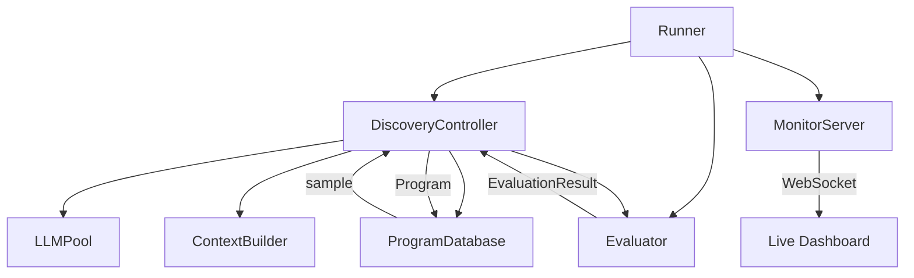

## High-Level Architecture

SkyDiscover's architecture separates orchestration, search logic, generation, and evaluation into distinct layers:



## Core Classes

### Runner

The top-level entry point for a discovery run. It wires everything together and manages the lifecycle.

**Responsibilities:**
- Loads configuration from YAML or a `Config` object
- Creates the `ProgramDatabase` based on the search type
- Instantiates the `DiscoveryController`
- Evaluates and adds the initial program (if provided)
- Starts the live monitor server
- Runs the main discovery loop via the controller
- Saves checkpoints at configured intervals
- Saves the best program on completion

```python
runner = Runner(
    evaluation_file="evaluator.py",
    initial_program_path="initial_program.py",  # optional
    config_path="config.yaml",
    output_dir="outputs/my_run",
)
best_program = await runner.run(iterations=100)
```

### DiscoveryController

Drives the sample → prompt → LLM → evaluate loop. The default implementation runs iterations sequentially or in parallel (controlled by `max_parallel_iterations`).

**Responsibilities:**
- Samples parent and context programs from the database
- Builds prompts via the context builder
- Calls the LLM (single-shot or agentic multi-turn)
- Parses responses (full rewrite or SEARCH/REPLACE diffs)
- Evaluates candidates through the Evaluator
- Adds scored programs back to the database
- Fires monitor callbacks for live updates

Subclasses override `run_discovery()` for different orchestration patterns:

| Controller | Search Type | Behavior |
|:---|:---|:---|
| `DiscoveryController` | topk, beam_search, best_of_n, openevolve_native | Default sequential/parallel loop |
| `AdaEvolveController` | adaevolve | Adds paradigm breakthrough detection and adaptive intensity |
| `CoEvolutionController` | evox | Interleaves solution evolution with search strategy evolution |
| `GEPANativeController` | gepa_native | Adds acceptance gating and LLM-mediated merge |

### ProgramDatabase

Abstract base class for program storage and sampling. Every search algorithm implements its own database subclass.

**Core interface:**

```python
class ProgramDatabase(ABC):
    @abstractmethod
    def add(self, program: Program, iteration: int = None) -> str:
        """Add a scored program to the database."""
        ...

    @abstractmethod
    def sample(self, num_context_programs: int = 4) -> Tuple[Program, List[Program]]:
        """Sample a parent and context programs for the next iteration."""
        ...
```

The `sample()` return type can be plain or dict-wrapped. Plain returns `(parent, [context_programs])`. Dict-wrapped returns `({info: parent}, {info: [context_programs]})` where the keys carry additional metadata (e.g., island name, selection reason).

**Built-in implementations:**

| Database | Strategy |
|:---|:---|
| `TopKDatabase` | Always returns the best program as parent |
| `BestOfNDatabase` | Returns the best program, generates N variants |
| `BeamSearchDatabase` | Maintains a beam with configurable selection (best, stochastic, diversity-weighted) |
| `OpenEvolveNativeDatabase` | MAP-Elites archive with island-based populations |
| `AdaEvolveDatabase` | Multi-island with UCB selection, migration, unified archive |
| `SearchStrategyDatabase` | EvoX co-evolution database for search strategies |
| `GEPANativeDatabase` | Elite pool with epsilon-greedy selection |

### Evaluator

Runs the user-provided evaluation function on candidate programs with timeout, retry, and optional cascade evaluation.

**How it works:**
1. Writes the candidate solution to a temp file
2. Calls `evaluate(program_path)` from the user's evaluator module
3. Normalizes the result into an `EvaluationResult`
4. Optionally runs LLM-as-a-judge for additional feedback
5. Cleans up temp files

**Cascade evaluation** runs in stages — a fast `evaluate_stage1()` filters out clearly bad solutions before the full `evaluate_stage2()` runs:

```python
evaluator:
  cascade_evaluation: true
  cascade_thresholds: [0.3, 0.6]
```

## Data Flow

### Program

The `Program` dataclass represents a single solution in the database:

```python
@dataclass
class Program:
    id: str                                    # Unique identifier
    solution: str                              # The code/content
    language: str = "python"                   # Solution language

    metrics: Dict[str, Any] = {}               # Evaluation scores
    parent_id: Optional[str] = None            # Parent it was derived from
    iteration_found: int = 0                   # When it was discovered
    artifacts: Dict[str, Any] = {}             # Evaluator feedback
    metadata: Dict[str, Any] = {}              # Changes, parent metrics, etc.
    timestamp: float = time.time()             # Creation time
    generation: int = 0                        # Evolutionary generation
    other_context_ids: Optional[List[str]]     # Context program IDs
    parent_info: Optional[Tuple[str, str]]     # (label, parent_id)
    context_info: Optional[List[Tuple]]        # [(label, context_id), ...]
    prompts: Optional[Dict[str, Any]] = None   # Logged prompts (if enabled)
```

### EvaluationResult

Returned by the evaluator:

```python
@dataclass
class EvaluationResult:
    metrics: Dict[str, float]                          # Must include combined_score
    artifacts: Dict[str, Union[str, bytes]] = {}       # Textual feedback for LLM
```

## Configuration System

SkyDiscover uses a hierarchical dataclass-based configuration loaded from YAML:

```yaml
max_iterations: 100
checkpoint_interval: 10

llm:
  models:
    - name: "gpt-5"
      weight: 1.0
  max_tokens: 32000
  timeout: 600

search:
  type: "adaevolve"
  num_context_programs: 4
  database:
    population_size: 20
    num_islands: 2

prompt:
  system_message: "You are an expert at optimizing algorithms."

evaluator:
  timeout: 360
  cascade_evaluation: true

monitor:
  enabled: true
```

Each search type has its own `DatabaseConfig` subclass with algorithm-specific parameters (e.g., `AdaEvolveDatabaseConfig` adds `num_islands`, `decay`, `use_ucb_selection`, etc.).

## Registry System

Search algorithms are registered in `route.py` using two registries:

```python
# Database registry — maps search type to ProgramDatabase subclass
register_database("adaevolve", AdaEvolveDatabase)
register_database("beam_search", BeamSearchDatabase)
register_database("topk", TopKDatabase)

# Controller registry — maps search type to DiscoveryController subclass
register_controller("adaevolve", AdaEvolveController)
register_controller("evox", CoEvolutionController)
register_controller("gepa_native", GEPANativeController)
```

If no controller is registered for a search type, the default `DiscoveryController` is used.

## Checkpointing

Checkpoints are saved at regular intervals (default: every 10 iterations) to `outputs/<search>/<problem>_<timestamp>/checkpoints/`:

```
checkpoint_50/
├── programs.json           # All programs with metrics and metadata
├── best_program.py         # Best solution code
├── best_program_info.json  # Best program metadata
└── prompts/                # Logged prompts (if enabled)
    └── <program_id>.json
```

Resume from a checkpoint:

```bash
uv run skydiscover-run initial_program.py evaluator.py \
  --checkpoint outputs/adaevolve/problem_0305/checkpoints/checkpoint_50
```

## Monitoring

When `monitor.enabled: true`, the Runner starts a `MonitorServer` that pushes real-time events over WebSocket:

- **program_added** — new program evaluated, with metrics and solution
- **best_updated** — new best program found
- **discovery_complete** — run finished or early-stopped

The dashboard (`skydiscover-viewer`) renders:
- Scatter plot of all programs (score vs. iteration)
- Code diffs between parent and child
- Metrics breakdown per program
- AI-generated summaries of progress
- Human feedback panel for real-time steering

## Extension Points

SkyDiscover is designed to be extended at every layer:

| Extension | How |
|:---|:---|
| **Custom search algorithm** | Subclass `ProgramDatabase`, implement `add()` and `sample()`, register with `register_database()` |
| **Custom controller** | Subclass `DiscoveryController`, override `run_discovery()`, register with `register_controller()` |
| **Custom context builder** | Subclass `BaseContextBuilder`, implement `build_prompt()` |
| **Custom evaluator** | Write a Python file with `evaluate(program_path)` returning a metrics dict |
| **External backend** | Add a runner function in `extras/external/` for third-party frameworks |
