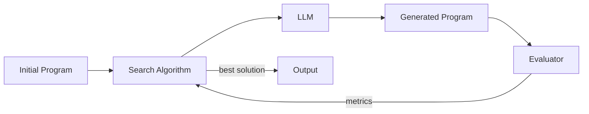

## What SkyDiscover Enables

SkyDiscover is a general-purpose framework for using LLMs to discover better solutions to optimization problems. It works across diverse domains:

- **Mathematics** — circle packing, Erdős problems, geometric optimization
- **Algorithms** — competitive programming, sorting networks, heuristics
- **System configurations** — cloud scheduling, GPU load balancing, MoE expert placement
- **Prompts** — automatic prompt optimization for question answering
- **Creative content** — AI image generation evolution

In each case, you provide a **scoring function** that evaluates candidates, and SkyDiscover handles the rest — iteratively generating, evaluating, and selecting improved solutions.

## Core Components

The discovery loop has four essential components:



### 1. Initial Program (Optional)

Your starting solution. It can be a complete program or just a stub. Use `EVOLVE-BLOCK-START` / `EVOLVE-BLOCK-END` markers to constrain which parts the LLM can modify:

```python
# EVOLVE-BLOCK-START
def solve(input_data):
    return input_data  # baseline — SkyDiscover will improve this
# EVOLVE-BLOCK-END
```

When omitted entirely, the LLM generates a solution from scratch. If markers are not present, the entire file is treated as mutable.

### 2. Search Algorithm

The strategy for sampling parents, providing context, and managing the population of solutions. SkyDiscover ships with seven algorithms:

| Algorithm | Complexity | Key Idea |
|:---|:---|:---|
| **TopK** | Simple | Always refine the current best solution |
| **BestOfN** | Simple | Generate N variants from the same parent, keep the best |
| **BeamSearch** | Moderate | Maintain a beam of top candidates, expand breadth-first |
| **OpenEvolve Native** | Moderate | MAP-Elites + island-based evolutionary search |
| **GEPA Native** | Advanced | Pareto-efficient search with acceptance gating and LLM-mediated merge |
| **AdaEvolve** | Advanced | Multi-island adaptive search with UCB, migration, and paradigm breakthroughs |
| **EvoX** | Advanced | Co-evolves the search strategy itself via meta-learning |

Each algorithm implements two core methods on the `ProgramDatabase`:
- `add(program)` — insert a scored program into the population
- `sample()` — select a parent and context programs for the next iteration

### 3. Evaluator

A Python function you write that scores candidate solutions. It receives a file path to the generated program and returns a dict:

```python
def evaluate(program_path):
    score = run_and_grade(program_path)
    return {
        "combined_score": score,       # primary optimization target (maximized)
        "artifacts": {                 # optional — stored and fed back to LLM
            "feedback": "Off by one in the loop boundary",
        },
    }
```

- **`combined_score`** is required and drives the search. Higher is better.
- **`artifacts`** are optional key-value pairs injected into the next LLM prompt as context, helping the model understand why a solution scored poorly.

### 4. LLM

Any LiteLLM-compatible model. SkyDiscover wraps models in an `LLMPool` that supports weighted random sampling from multiple models:

```yaml
llm:
  models:
    - name: "gpt-5"
      weight: 0.7
    - name: "gemini/gemini-3-pro-preview"
      weight: 0.3
```

## The Discovery Loop

Each iteration follows a six-step cycle:

1. **Sample** — The search algorithm selects a parent program and context programs from the database.
2. **Prompt** — The context builder assembles a prompt containing the parent solution, its metrics, relevant history, and any artifacts or human feedback.
3. **Generate** — The LLM produces an improved solution (as a full rewrite or SEARCH/REPLACE diff blocks).
4. **Evaluate** — Your evaluator function scores the candidate, producing metrics and optional artifacts.
5. **Add** — The scored program is inserted into the database. The search algorithm updates its internal state (e.g., UCB scores, island populations, Pareto frontiers).
6. **Adapt** — Advanced algorithms (AdaEvolve, EvoX) adjust their strategy based on observed progress — mutation intensity, island spawning, paradigm breakthroughs, or meta-evolution of the search itself.

## Key Design Principles

**Modularity** — Every component (search algorithm, context builder, evaluator, LLM) is behind a clean interface. Swap implementations without touching other parts of the system.

**Fairness** — All algorithms share the same Runner, Evaluator, and LLM infrastructure. Benchmarks are comparable because only the search strategy differs.

**Extensibility** — Add a new search algorithm by implementing `ProgramDatabase.add()` and `ProgramDatabase.sample()`. Register it in `route.py` and it works with the full framework — CLI, Python API, checkpointing, monitoring.

## What Makes SkyDiscover Different

Unlike single-algorithm tools, SkyDiscover is a **framework** that lets you:

- Run any algorithm on any problem through a single CLI or Python API
- Compare algorithms fairly under identical budgets and infrastructure
- Mix and match components — use AdaEvolve's database with a custom context builder, or EvoX's co-evolution with your own evaluator
- Monitor and steer discovery in real time through a live dashboard with human feedback

## Performance Highlights

| Benchmark Suite | Result |
|:---|:---|
| **Frontier-CS (172 problems)** | ~34% median improvement over OpenEvolve, GEPA, ShinkaEvolve |
| **Math + Systems (12 tasks)** | Matches or exceeds AlphaEvolve on 12/14 tasks |
| **Cross-cloud transfer** | 41% lower cost |
| **MoE GPU load balancing** | 14% better balance |
| **KV-cache pressure** | 29% reduction |
