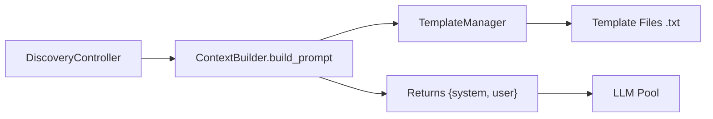

Context builders control how the current program state, metrics, and history are assembled into the system and user messages sent to the LLM. Every search algorithm uses a context builder to translate database state into prompts.

## Architecture



1. The controller calls `build_prompt()` with the current program, context programs, and metadata.
2. The builder renders templates using `TemplateManager`, filling in placeholders.
3. The result is a `{"system": str, "user": str}` dict passed to the LLM.

## Directory Structure

```
skydiscover/context_builder/
├── base.py                    # ContextBuilder ABC
├── utils.py                   # TemplateManager
├── human_feedback.py          # Human feedback integration
├── default/
│   ├── builder.py             # DefaultContextBuilder
│   └── templates/
│       ├── system_message.txt
│       ├── diff_user_message.txt
│       ├── full_rewrite_user_message.txt
│       ├── full_rewrite_prompt_opt_user_message.txt
│       ├── from_scratch_user_message.txt
│       └── image_user_message.txt
└── evox/
    └── templates/             # Overrides for EvoX
```

## Default Templates

| Template | Used When |
|:---------|:----------|
| `system_message.txt` | Always — sets the system role and task description |
| `diff_user_message.txt` | Diff-based generation (`diff_based_generation: true`) |
| `full_rewrite_user_message.txt` | Full rewrite mode for code tasks |
| `full_rewrite_prompt_opt_user_message.txt` | Full rewrite mode for prompt optimization (`language: text`) |
| `from_scratch_user_message.txt` | No initial program — generating from scratch |
| `image_user_message.txt` | Image-based evaluation tasks |

---

## When to Write a Custom Builder

Use a custom context builder when you need:

- **Algorithm-specific state** in prompts (e.g., island ID, search mode, paradigm history)
- **Dynamic guidance** that changes based on search progress (e.g., "explore more" vs "refine")
- **Custom context formatting** (e.g., structured XML blocks, rejection history, merge instructions)

If you only need to change the system prompt text, use `prompt.system_message` in your config YAML instead — no custom builder needed.

---

## Writing a Custom Builder

### Basic Pattern

Extend `DefaultContextBuilder` and override `build_prompt` to inject custom placeholders:

```python
from skydiscover.context_builder.default.builder import DefaultContextBuilder
from skydiscover.search.base_database import Program
from skydiscover.config import Config
from typing import Any, Dict, List, Optional, Union


class MyContextBuilder(DefaultContextBuilder):
    def __init__(self, config: Config):
        super().__init__(config)
        self.search_guidance = ""

    def set_search_guidance(self, guidance: str):
        self.search_guidance = guidance

    def build_prompt(
        self,
        current_program: Union[Program, Dict[str, Program]],
        context: Dict[str, Any] = None,
        **kwargs: Any,
    ) -> Dict[str, str]:
        prompt = super().build_prompt(current_program, context, **kwargs)

        prompt["system"] = prompt["system"].replace(
            "{search_guidance}", self.search_guidance
        )

        return prompt
```

### Complete Example: Island-Based Search Builder

A builder that includes island-specific context and adaptive search guidance:

```python
from skydiscover.context_builder.default.builder import DefaultContextBuilder
from skydiscover.search.base_database import Program
from skydiscover.config import Config
from typing import Any, Dict, Union


class IslandContextBuilder(DefaultContextBuilder):
    def __init__(self, config: Config):
        super().__init__(config)
        self.current_island = 0
        self.search_mode = "balanced"
        self.stagnation_counter = 0

    def build_prompt(
        self,
        current_program: Union[Program, Dict[str, Program]],
        context: Dict[str, Any] = None,
        **kwargs: Any,
    ) -> Dict[str, str]:
        prompt = super().build_prompt(current_program, context, **kwargs)

        guidance = self._build_guidance()

        prompt["system"] = prompt["system"].replace(
            "{search_guidance}", guidance
        )

        return prompt

    def _build_guidance(self) -> str:
        if self.search_mode == "exploration":
            return (
                f"[Island {self.current_island} — EXPLORATION MODE]\n"
                "Try fundamentally different approaches. "
                "Prioritize novelty over incremental improvement."
            )
        elif self.search_mode == "exploitation":
            return (
                f"[Island {self.current_island} — EXPLOITATION MODE]\n"
                "Refine the current approach. "
                "Make targeted, small improvements to boost the score."
            )
        else:
            return (
                f"[Island {self.current_island} — BALANCED MODE]\n"
                "Balance exploration and refinement."
            )
```

### Template with Placeholder

Add `{search_guidance}` to your system message template:

```text
You are an expert algorithm designer.

{search_guidance}

Current best score: {metrics}

Improve the following program:
{program}
```

### Controller Integration

Replace the default builder in your controller:

```python
class MyController(DiscoveryController):
    def __init__(self, controller_input):
        super().__init__(controller_input)
        self.context_builder = IslandContextBuilder(self.config)

    async def run_discovery(self, start_iteration, max_iterations, **kwargs):
        for iteration in range(start_iteration, max_iterations):
            # Update builder state before each iteration
            self.context_builder.current_island = self._select_island()
            self.context_builder.search_mode = self._get_mode()

            result = await self._run_iteration(iteration)
            self._process_iteration_result(result, iteration, None, True)

        return self._finalize_discovery()
```

The controller's `_build_prompt` method uses `self.context_builder` internally. The `_prompt_context` dict passed to `build_prompt` includes keys like `failed_attempts`, `num_context_programs`, and any algorithm-specific state.

### Registration via Config

Point your algorithm's config to the custom builder by setting it in the controller's `_init_context_builder` method:

```python
def _init_context_builder(self):
    self.context_builder = IslandContextBuilder(self.config)
```

---

## Advanced: Dynamic Guidance

Adapt the prompt based on search progress:

```python
class AdaptiveContextBuilder(DefaultContextBuilder):
    def __init__(self, config):
        super().__init__(config)
        self.iterations_without_improvement = 0
        self.best_score = 0.0

    def update_progress(self, current_score: float):
        if current_score > self.best_score:
            self.best_score = current_score
            self.iterations_without_improvement = 0
        else:
            self.iterations_without_improvement += 1

    def build_prompt(self, current_program, context=None, **kwargs):
        prompt = super().build_prompt(current_program, context, **kwargs)

        if self.iterations_without_improvement > 20:
            guidance = (
                "The search has stagnated for 20+ iterations. "
                "Try a completely different algorithmic approach. "
                "Consider changing the core data structure or strategy."
            )
        elif self.iterations_without_improvement > 10:
            guidance = (
                "Progress has slowed. Consider larger structural changes "
                "rather than parameter tuning."
            )
        else:
            guidance = "Continue refining the current approach."

        prompt["system"] = prompt["system"].replace(
            "{search_guidance}", guidance
        )
        return prompt
```

---

## Template Variables

These placeholders are available in the default templates:

| Variable | Description |
|:---------|:------------|
| `{program}` | The current program source code |
| `{language}` | Programming language (`python`, `cpp`, `text`) |
| `{metrics}` | Formatted metrics from the current best solution |
| `{context_programs}` | Source code and scores of context programs |
| `{search_guidance}` | Custom guidance string (when using a custom builder) |
| `{errors}` | Error messages from failed previous attempts |
| `{db_stats}` | Database statistics (iteration count, best score, population size) |

---

## Real-World Examples

### AdaEvolve Builder

The `AdaEvolveContextBuilder` extends the default builder with:

- **Evaluator feedback** — includes artifact feedback from the evaluator in the prompt
- **Paradigm context** — when a paradigm breakthrough is triggered, includes the paradigm strategy description
- **Sibling context** — shows other programs from the same island for diversity awareness
- **Mode-aware prompting** — switches between exploration and exploitation prompt styles

### EvoX Builder

The EvoX context builder injects:

- **Strategy description** — the current search algorithm's description and variation operators
- **Co-evolution state** — whether the system is evolving solutions or the search algorithm itself

---

## TemplateManager API

The `TemplateManager` loads `.txt` template files from one or more directories. Later directories override earlier ones, enabling algorithm-specific template overrides.

```python
from skydiscover.context_builder.utils import TemplateManager

manager = TemplateManager(
    "skydiscover/context_builder/default/templates",
    "my_algorithm/templates",  # overrides default templates
)

template = manager.get_template("system_message")
```

| Method | Signature | Description |
|:-------|:----------|:------------|
| `__init__` | `(*directories: Optional[str])` | Load `.txt` files from directories. Later directories override earlier ones |
| `get_template` | `(name: str) -> str` | Return template content. Raises `ValueError` if not found |
| `templates` | `property -> Dict[str, str]` | All loaded templates as `{name: content}` |
