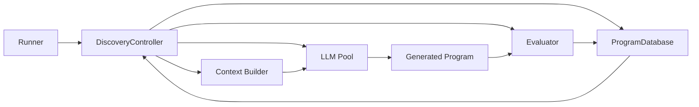

## What is SkyDiscover?

**SkyDiscover** is a modular framework for AI-driven scientific and algorithmic discovery. It provides a unified interface for implementing, running, and fairly comparing discovery algorithms across **200+ optimization tasks** — from circle packing and Erdős problems to GPU kernel optimization and cloud scheduling.

You give SkyDiscover an **evaluator** (a scoring function) and, optionally, a **starting solution**. It then uses LLM-powered search algorithms to iteratively discover better solutions, guided by your evaluator's feedback.

SkyDiscover introduces two new adaptive optimization algorithms:

- **[AdaEvolve](https://arxiv.org/abs/2602.20133)** — dynamically adjusts its optimization behavior based on observed progress using multi-island UCB selection, migration, and paradigm breakthroughs.
- **[EvoX](https://arxiv.org/abs/2602.23413)** — co-evolves the search strategy itself alongside the solution using LLM-driven meta-learning.

It also supports OpenEvolve, ShinkaEvolve, and GEPA as both external backends and native reimplementations, enabling fair apples-to-apples benchmarking under identical generation budgets.

## Key Features

<CardGroup cols={2}>
  <Card title="AdaEvolve & EvoX" icon="bolt">
    Two novel adaptive algorithms that outperform existing open-source methods across 200+ benchmarks.
  </Card>
  <Card title="Multiple Search Strategies" icon="magnifying-glass">
    TopK, BeamSearch, BestOfN, OpenEvolve Native, GEPA Native, AdaEvolve, and EvoX — all through a single interface.
  </Card>
  <Card title="200+ Benchmarks" icon="chart-bar">
    Math, systems optimization, GPU kernels, competitive programming (Frontier-CS), ARC-AGI reasoning, and more.
  </Card>
  <Card title="Flexible Model Support" icon="microchip">
    Any LiteLLM-compatible model works out of the box — OpenAI, Gemini, Anthropic, or local models via Ollama/vLLM.
  </Card>
  <Card title="Live Monitoring" icon="desktop">
    Real-time dashboard with scatter plots, code diffs, metrics, AI summaries, and a human feedback panel to steer evolution.
  </Card>
  <Card title="Modular Architecture" icon="puzzle-piece">
    Swap out any component — search algorithm, context builder, evaluator, or LLM — without touching the rest of the system.
  </Card>
</CardGroup>

## Architecture Overview

SkyDiscover follows a clean separation of concerns. The **Runner** orchestrates the lifecycle, the **DiscoveryController** drives the sample → prompt → generate → evaluate loop, and the **ProgramDatabase** stores and samples solutions.

1. The **ProgramDatabase** samples a parent program and context programs.
2. The **Context Builder** assembles a prompt with the parent solution, metrics, and relevant history.
3. The **LLM Pool** generates an improved solution (full rewrite or diff-based).
4. The **Evaluator** scores the candidate against your evaluation function.
5. The result is added back to the **ProgramDatabase**, and the loop continues.

## Real-World Impact

Across approximately 200 optimization benchmarks, AdaEvolve and EvoX achieve the strongest open-source results — matching or exceeding AlphaEvolve and human state-of-the-art:

| Metric | Result |
|:---|:---|
| **Frontier-CS (172 problems)** | ~34% median score improvement over OpenEvolve, GEPA, and ShinkaEvolve |
| **Math + Systems (12 tasks)** | Matches or exceeds AlphaEvolve and human SOTA on 12/14 tasks |
| **KV-cache pressure** | 29% lower via GPU model placement optimization |
| **GPU load balancing** | 14% better for MoE expert serving |
| **Cross-cloud transfer cost** | 41% lower through optimized scheduling |

## Next Steps

<CardGroup cols={2}>
  <Card title="Quick Start" icon="rocket" href="/quickstart">
    Get up and running in under 5 minutes with the circle packing example.
  </Card>
  <Card title="Installation" icon="download" href="/installation">
    Detailed install instructions, extras, and environment configuration.
  </Card>
  <Card title="Core Concepts" icon="book" href="/concepts/overview">
    Understand the architecture, algorithms, and evaluation framework.
  </Card>
  <Card title="Search Algorithms" icon="brain" href="/concepts/algorithms">
    Choose the right algorithm for your problem and learn how each one works.
  </Card>
</CardGroup>
